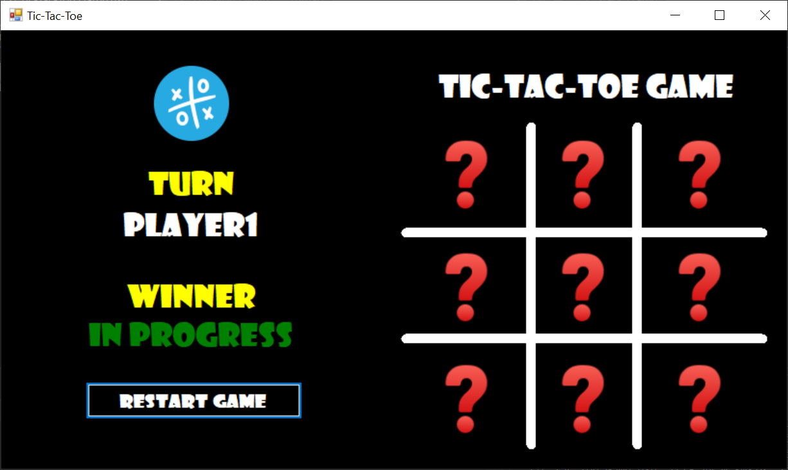
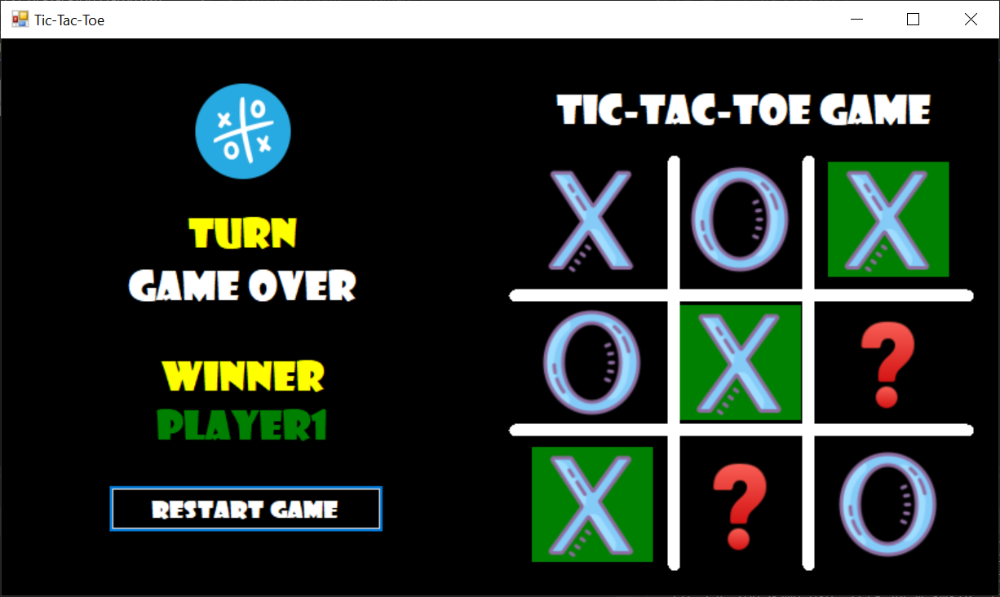

# ❌⭕ Tic-Tac-Toe Game

A desktop implementation of the classic Tic-Tac-Toe game, built with C# Windows Forms.

## Overview
Tic-Tac-Toe is a two-player desktop game where players take turns marking 
spaces on a 3×3 grid. The first player to align three marks horizontally, 
vertically, or diagonally wins the round.

## Features
- **Two Player Mode** — Player 1 (X) vs Player 2 (O) on the same machine
- **Turn Indicator** — Clearly displays whose turn it is
- **Win Detection** — Highlights the winning combination in green
- **Draw Detection** — Recognizes when the board is full with no winner
- **Restart Game** — Reset the board instantly with one click
- **Visual Design** — Dark themed UI with colored X and O marks

## Screenshots

**Game In Progress**

**Player 1 Wins**

## Screens

| Screen | Description |
|---|---|
| **Game Board** | 3×3 interactive grid where players place their marks |
| **Turn Panel** | Shows current player turn and winner result |

## 🛠️ Technologies
- C# (.NET WinForms)
- Visual Studio
